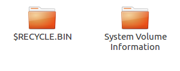

## 前言

作者最近在尝试把Ubuntu系统装在移动硬盘中。系统安装成功了，但是500G的硬盘装一个Ubuntu总是有些浪费。在网上也没有找到相关的教程，于是自己捣鼓做了一下。

## 第一步: 压缩卷

## 第二步：转换格式

## 第三步：测试

在Windows中，Share盘会在`此电脑`下显示。

在Ubuntu中，Share盘会在菜单栏和文件管理器中显示，可以自由访问。

另外，在Ubuntu系统中会显示一些Win10下看不见的文件。

估计这些文件**对windows中的分盘会有影响**，作者没有删除进行测试，也没有找到什么隐藏的方法。如果有知道的朋友欢迎在评论区留言。

## 结语

本文其实就是做了一个把EXT4文件系统转为了xxx文件系统的工作，非常的简单。Ubuntu其实是可以自由访问Windows下的文件的，但是Windows就需要借助一些像`DiskInternals Linux Reader`，`Ext2Read`之类的软件。为了追求方便，当然是直接转为windows能直接浏览的xxx文件系统会更好啦！